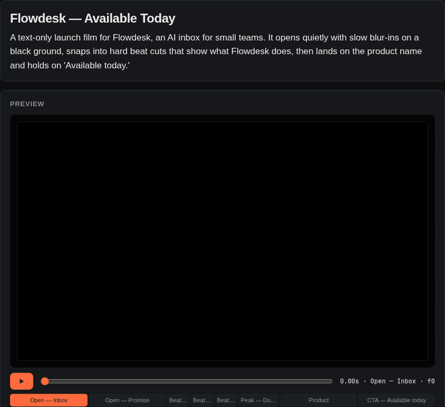

# RefCut

**Show it a reference, add a line of context — RefCut builds it in DaVinci Resolve.**

RefCut is a local web app that connects **Claude** (the brain) to **DaVinci Resolve** (the editor).
It has three **modes**, one per kind of video, chosen at the top of the left panel: **Talking video**
(shorts and long YouTube stories), **Kinetic text** and **Mascot video**. A fourth tool, *Match a reference
edit*, sits under the mode bar. What each one does:

- **Kinetic text** — Apple-style, text-only launch videos. Claude writes a motion script, you preview and
  tweak it in the browser, and RefCut builds it as **keyframed Fusion comps** (one per scene) on a Resolve
  timeline, synced to your music.
- **Talking video** — dev logs, "building in public" updates and feature walkthroughs. Put your long,
  rough footage on a Resolve timeline and describe the video in a line. RefCut transcribes it and Claude
  cuts it tight: a hook first, filler and retakes out, punch-in zooms on jump cuts, title cards, callouts,
  captions. It builds a **new timeline** next to yours.
- **YouTube story** — the long-form version of a talking video: a cold open, your own B-roll cut over your
  voice, text cards, chapters, quiet subtitles and a music bed. It can mirror a reference video you link.
- **Mascot video** — faceless explainers. Claude writes the script, RefCut's built-in voice speaks it in a
  voice you design once, and Mage hosts on screen with text timed to the spoken words.
- **English + Kiswahili** — talking videos understand speech that switches between the two.
- **Mage** — Mali Daftari's mascot as a motion character in any kinetic or talking video. It pops in,
  reacts (happy, confused, thinking…), pushes up its glasses and hosts the intro and outro.
- **Motion B-roll** — in a talking video, one click has Claude design animated cutaways and panels
  timed to your words (a morphing shape, a cursor, spring motion) using the bundled `motion-broll` skill.
- **Match a ref** — drop a reference edit and point at your clips. RefCut measures the reference
  (cuts, beat sync, pacing, colour, text, speech), Claude maps your footage onto the same recipe, and it's
  cut into a Resolve timeline.

<p align="center">
  
  <br><sub>A 10-second launch film Claude scripted from a two-sentence prompt and a music track, played in RefCut's live preview. Every cut lands on the beat; <b>Build it</b> turns each scene into a keyframed Fusion comp in Resolve.</sub>
</p>

Works with **DaVinci Resolve Free** (no Studio licence needed) and your normal **Claude subscription**
(no API key).

```
 ┌──────────── your Windows PC ─────────────────────────────────────────────────┐
 │                                                                              │
 │   Browser ──► RefCut (localhost:7860) ──► claude -p  (your Claude login)     │
 │                    │                                                         │
 │                    └──► CursorBridge (localhost:9876, runs INSIDE Resolve)   │
 │                              └──► DaVinci Resolve API → project, timeline,   │
 │                                   clips, Fusion comps                        │
 └──────────────────────────────────────────────────────────────────────────────┘
```

Everything runs on one machine. Nothing is exposed to the network — both servers listen on `127.0.0.1` only.

---

## Contents

1. [Requirements](#1-requirements)
2. [Install DaVinci Resolve](#2-install-davinci-resolve)
3. [Install and log in to Claude Code](#3-install-and-log-in-to-claude-code)
4. [Get RefCut and run setup](#4-get-refcut-and-run-setup)
5. [Connect RefCut to DaVinci Resolve](#5-connect-refcut-to-davinci-resolve)
6. [Start RefCut and check the status lights](#6-start-refcut-and-check-the-status-lights)
7. [Make your first kinetic-text video](#7-make-your-first-kinetic-text-video)
8. [One-time calibration (text size + font)](#8-one-time-calibration-text-size--font)
9. [Match a ref](#9-match-a-ref)
10. [Talking videos (dev logs, feature walkthroughs)](#10-talking-videos-dev-logs-feature-walkthroughs)
11. [Mage, the motion character](#11-mage-the-motion-character)
12. [Motion B-roll and bundled skills](#12-motion-b-roll-and-bundled-skills)
13. [YouTube stories (long-form)](#13-youtube-stories-long-form)
14. [Mascot videos and the generated voice](#14-mascot-videos-and-the-generated-voice)
15. [English + Kiswahili speech](#15-english--kiswahili-speech)
16. [Every-day workflow (cheat sheet)](#16-every-day-workflow-cheat-sheet)
17. [Troubleshooting](#17-troubleshooting)
18. [How it works](#18-how-it-works)

---

## 1. Requirements

| | |
|---|---|
| OS | Windows 10/11 (64-bit). macOS/Linux work for the web app; setup scripts are Windows-only. |
| DaVinci Resolve | 18 or newer — **Free or Studio** |
| Claude | A Claude account (Pro/Max) for Claude Code |
| Disk | ~3 GB for Python packages (PyTorch CPU, Whisper) + 3.3 GB voice model + Resolve itself |
| Node.js | 18 or newer, only for motion B-roll (setup installs it) |
| Voice model | Only for mascot videos: 3.3 GB, downloaded by setup. Runs on the CPU, or on an NVIDIA GPU if you install the CUDA build of PyTorch |
| Internet | Needed for setup and for Claude; editing itself is local |

Setup installs these automatically if missing: **Python 3.12**, **ffmpeg**, **Node.js** (via `winget`).

---

## 2. Install DaVinci Resolve

1. Download from <https://www.blackmagicdesign.com/products/davinciresolve> (the free version is fine).
2. Install and open it once, then create or open any project so it finishes first-run setup.
3. Close Resolve for now — setup needs to copy a script into Resolve's folders.

---

## 3. Install and log in to Claude Code

RefCut talks to Claude through the Claude Code CLI, using your normal Claude login.

1. Open **PowerShell** and run:
   ```powershell
   irm https://claude.ai/install.ps1 | iex
   ```
2. Close and reopen PowerShell, then run:
   ```powershell
   claude
   ```
3. Follow the login prompt in your browser. When Claude Code shows its prompt, type `/exit`.

That's it — RefCut runs `claude` in the background with this login.

---

## 4. Get RefCut and run setup

**Option A — with git**
```powershell
cd $HOME\Desktop
git clone https://github.com/kingzion24/refcut.git
cd refcut
```

**Option B — without git:** on GitHub click **Code → Download ZIP**, unzip it to e.g. `Desktop\refcut`.

Then **double-click `setup.bat`** (or run `powershell -ExecutionPolicy Bypass -File setup.ps1`). It:

1. Installs Python 3.12 and ffmpeg with `winget` if they're missing.
2. Creates a private Python environment in `refcut\venv` and installs the packages
   (CPU-only PyTorch, so no multi-GB CUDA download).
3. **Copies the bridge script into Resolve**:
   `%APPDATA%\Blackmagic Design\DaVinci Resolve\Support\Fusion\Scripts\Utility\CursorBridge.py`
4. Registers the DaVinci MCP server with Claude Code (optional bonus — lets you drive Resolve from a
   `claude` terminal session too).
5. Installs RefCut's bundled Claude skills into `%USERPROFILE%\.claude\skills\` (see section 12).
6. Installs Node.js if it's missing and downloads the motion B-roll renderer (~150 MB).
7. Downloads the voice model for mascot videos (3.3 GB). To skip it:
   `powershell -ExecutionPolicy Bypass -File setup.ps1 -NoVoiceModel` (it then downloads the first time you design a voice).

Updating from an older RefCut: copy the new folder over the old one, run `setup.bat` again, and in Resolve
run **Workspace → Scripts → CursorBridge** again so it loads the new bridge.

It takes 5–15 minutes the first time. When it prints **Done**, continue.

> If setup says ffmpeg was installed but isn't on PATH, just close the window and open a new one —
> Windows only picks up PATH changes in new terminals.

---

## 5. Connect RefCut to DaVinci Resolve

Resolve Free doesn't allow outside programs to control it, **but it does run scripts from its own
Workspace menu**. RefCut ships a small script, **CursorBridge**, that you start from inside Resolve; it
opens a local connection (`127.0.0.1:9876`) that RefCut uses to build projects, timelines and Fusion comps.

**Every time you open Resolve:**

1. Open DaVinci Resolve and open (or create) any project.
2. In the top menu: **Workspace → Scripts → CursorBridge**.
3. Resolve's Console opens and prints:
   ```
   [CursorBridge] Connected to Resolve: DaVinci Resolve 19.x
   [CursorBridge] Bridge is running (read + write)
   ```
4. You can close the Console window — the bridge keeps running until you quit Resolve.

**Don't see CursorBridge in the menu?**
- Restart Resolve (it scans the Scripts folder at startup).
- Check the file exists at `%APPDATA%\Blackmagic Design\DaVinci Resolve\Support\Fusion\Scripts\Utility\CursorBridge.py`
  (paste that path into Explorer's address bar). If not, re-run `setup.bat`.
- Resolve needs a system Python 3 to run `.py` scripts — setup installs Python 3.12. If the Console says it
  can't find Python, install Python 3.12 (64-bit) from python.org with **"Add to PATH"** ticked, then restart Resolve.

---

## 6. Start RefCut and check the status lights

**Double-click `start.bat`.** A terminal window opens (leave it running) and your browser opens
<http://localhost:7860>.

Top-right of the page are three status lights. **Claude** and **DaVinci** should be green before you build;
**Voice** only matters for mascot videos:

| Light | 🟢 Green | 🟠 Amber | 🔴 Red |
|---|---|---|---|
| **Claude** | Installed, logged in, answered a test call. Shows the version. | Error talking to Claude | Not installed / not logged in |
| **DaVinci** | Bridge connected. Shows your open project name. | Resolve is open but the bridge isn't started | Resolve isn't running |
| **Voice** | At least one voice is designed; it shows how many. | No voice yet: click it and design one | The voice engine isn't installed: run setup again |

**Click a light** to see exactly what's wrong and how to fix it, plus a **Re-check** button. The lights refresh
every few seconds, so after you start CursorBridge the DaVinci light turns green on its own.

You can plan and preview with only Claude green; DaVinci only needs to be green when you click **Build it**
(and to read your timeline for a talking video). Clicking the Claude light also lists the bundled skills.

---

## 7. Make your first kinetic-text video

1. Pick the **Kinetic text** mode (left panel).
2. **Reference video** *(optional)* — drop a video you like the style of, or paste a TikTok / YouTube /
   Instagram link. RefCut samples frames through it so Claude can see how text enters, holds and exits.
3. **Context** — a line or two is enough:
   > Launch video for Flowdesk, an AI inbox for small teams. ~15s, calm opening then punchy beat cuts,
   > end on "Available today."
4. **Music to sync to** *(optional)* — choose a file or paste its path. RefCut finds the tempo and beats,
   and Claude lands scene changes on them.
5. **Format / FPS / Motion** — e.g. 16:9, 30, **Auto** (or **Smooth**, or **Stop-motion** = animation on twos).
6. Click **Analyze & plan**. After ~1–2 minutes you get:
   - **Preview** — press ▶ (or space). It plays the exact keyframes and easing curves that go into Fusion,
     with your music. Click scene chips to jump.
   - **Scenes** — edit any line's text, size, entrance/exit animation, timing and colour. Add, duplicate,
     reorder or delete scenes. The preview updates as you type.
   - **Look** — background, text and accent colours, font, weight, smooth vs stop-motion.
   - **Adjust** — ask in plain words: *"make it faster"*, *"stop-motion"*, *"add a scene about security"*.
7. Make sure the **DaVinci** light is green, optionally type a project name, and click **Build it**.

What Resolve gets:
- A project (created, or reused if the name exists) set to your resolution and frame rate.
- A new timeline with **one clip per scene** (orange), a blue marker per scene, and your music on A1.
- Each clip carries its own **Fusion comp**: `Text+ → Blur → Transform → Merge`, with keyframed opacity,
  blur, scale, position, rotation and tracking (and a Text Follower for letter-by-letter cascades).
- Resolve switches to the **Fusion page** — click a clip to see its nodes; every keyframe is editable in the
  Spline editor.

Prefer to do it by hand? **Download .comp files** and in Fusion use **File → Import → Composition**.

---

## 8. One-time calibration (text size + font)

Fusion's Text+ size unit isn't documented, so RefCut starts from a best estimate. After your **first**
build, compare text size in Resolve with the RefCut preview:

- Open **Fusion settings** (bottom of the left panel).
- **Text size calibration**: if text in Resolve is 2× too big, halve the number; 20% too small, multiply by
  1.2 — then **Save** and **Build it** again. You only do this once.
- **Default font**: must be installed in Windows, and the weight names (Regular / Semibold / Bold) must
  exist in that font. Segoe UI works out of the box. For the closest Apple look install
  [Inter](https://rsms.me/inter/) (right-click the .ttf files → **Install for all users**), restart Resolve,
  then set the font to `Inter`.

(Apple's own SF Pro is licensed for Apple platforms only.)

---

## 9. Match a ref

1. Under the mode bar, click **Other: match a reference edit**.
2. Drop a reference edit (or paste a link) and enter your **footage folder** (e.g. `D:\Footage\Trip`).
3. Add context → **Analyze & plan**. You get the recipe (pacing, cutting, look, text, music), a colour-coded
   timeline with beat ticks, and a shot-by-shot table matching each reference shot to one of your clips.
4. Adjust in plain words, then **Build it**. Resolve gets project settings, imported media, every cut with
   in/out points on the beat grid, music, markers and a CDL grade per clip.

The Resolve scripting API can't add transitions, keyframes/speed ramps, or type text into titles — the
blueprint lists those under *"You'll finish by hand"*.

---

## 10. Talking videos (dev logs, feature walkthroughs)

For videos where you talk: a dev-journey update, a feature walkthrough, a "here's what I shipped" clip.

1. **In Resolve**, put your raw footage on a timeline: talking head, screen recordings, or both, in
   roughly the order you recorded them. Trim anything you already know you don't want. RefCut uses
   exactly the part of each clip that's on the timeline.
2. **In RefCut**, pick the **Talking video** mode. Under *Your footage* keep **My Resolve timeline**; the
   card shows the timeline RefCut will read (click *Re-read* after changing it). No Resolve? Switch to
   **Files / folder** and paste file paths, one per line, or a folder.
3. **Context**: describe the rest in a line or two. For example:
   > Day 12 of building Mali Daftari: I got offline sync working. TikTok short, hook with the demo,
   > Mage confused at the bug and happy when it works.

   Product names in the context also help speech recognition spell them right.
4. **Format** (*Match timeline*, 9:16, 16:9…), **Length** (Auto, ~30 s, ~60 s… or *Just tighten*),
   **Captions** (*Burned in* = editable Text+, *Subtitle track* = .srt, *Off*), and tick **Feature Mage**.
5. **Analyze & plan.** RefCut transcribes every clip with word timings, samples frames so Claude can
   see face cam vs. screen, and Claude writes the edit plan (1–3 minutes for a few minutes of footage).
6. **Review.** The preview plays your actual footage with the cuts, cards, callouts, Mage and captions.
   In **Timeline**, each clip row shows what's said in it. Change in/out/zoom, reorder, duplicate to
   split, delete, or add cards. **Overlays** are pinned to a timeline item, so they move with it.
   Cuts snap to word boundaries automatically. Or ask in **Adjust**: *"tighter"*, *"open on the demo"*,
   *"add a card before the bug fix"*.
7. **Build it.** RefCut adds a new timeline to the open project; your original timeline isn't touched:

| Track | What's on it |
|---|---|
| V1 | Your cuts (in/out on word boundaries, punch-in zoom) and cards (Fusion comps, orange) |
| V2 · Callouts | Text overlays: transparent Fusion comps (yellow) |
| V3 · Mage | Mage as transparent PNG sequences (blue) |
| V4 · Captions | One Text+ comp per caption, so typos are fixable on the Fusion page. Or a subtitle track with *Subtitle track* |

With [motion B-roll](#12-motion-b-roll-and-bundled-skills), its clips take V2 (purple), directly above
your footage, and callouts, Mage and captions move up one track.
| A1 | The audio that goes with each cut |

Markers mark each card (blue) and overlay (yellow). Speech recognition quality: **Fusion settings →
Speech recognition** (*Accurate (small)* is better for accents, but slower).

---

## 11. Mage, the motion character

Mage is Mali Daftari's mascot: a brand-blue (`#0077B6`) round head with only eyes and browline glasses
(spec: `Mali-Daftari-Mobile/mali_daftari/docs/ui/08_MAGE.md`). RefCut draws it with the same geometry,
moods and timings as the app's `MageFace` widget.

Tick **Feature Mage** in *Kinetic text* or *Talking video* and Claude casts it. It hosts the intro and
outro, reacts in a corner over your footage, and does its signature glasses-off move once. In any scene
editor, **+ Mage** adds one by hand. Each Mage row sets the starting mood, size, entrance / exit and
variant (*reversed* = white head for brand-blue backgrounds).

- **Moods:** idle · thinking · talking (eyes squash, pushes glasses up) · happy · focused · confused ·
  searching
- **Beats:** blink · hop · glance · push (glasses) · glasses_off / glasses_on · signature
- **Moves:** glides to a new position / size, e.g. centre stage → corner to make room for a headline

Mage blinks and glances on its own. In Resolve it's a transparent PNG sequence on its own track
(V2 in kinetic videos, V3 in talking videos), frame-for-frame what the preview shows.

---

## 12. Motion B-roll and bundled skills

RefCut ships with Claude **skills** in `refcut\skills\`. Setup, and every start of RefCut, installs them
into this machine's Claude (`%USERPROFILE%\.claude\skills\`), so RefCut's own Claude calls and Claude Code
in your terminal can both use them. A skill you installed yourself under the same name is left alone.
Click the **Claude** status light to see them. To bundle another skill, drop its folder (with a
`SKILL.md`) into `refcut\skills\`.

| Skill | From | RefCut uses it for |
|---|---|---|
| `motion-broll` | [Barty-Bart/motion-graphics](https://github.com/Barty-Bart/motion-graphics) (MIT) | **Add motion B-roll** in a talking video |
| `agent-reach` | [Panniantong/Agent-Reach](https://github.com/Panniantong/Agent-Reach) (MIT) | Not used by RefCut's own steps. In Claude Code it is a guide for reading the internet (web pages, YouTube transcripts, GitHub, X, Reddit…), handy when researching a video |

`agent-reach` is a guide, not the tools: plain web pages work straight away, most platforms need the Agent
Reach tools, which you install by telling Claude Code
`Install Agent Reach: https://raw.githubusercontent.com/Panniantong/agent-reach/main/docs/install.md`.
RefCut's setup doesn't run that installer and never handles logins or cookies. Note that the skill tells Claude
to use it whenever you share a link or ask it to look something up, in any project on this PC. To remove it,
delete `%USERPROFILE%\.claude\skills\agent-reach` and the `refcut\skills\agent-reach` folder.

**Add motion B-roll** (talking video, under the preview):

1. Get the cut how you want it first. B-roll is made for the current edit.
2. Pick a density (Light / Medium / Heavy), optionally say what to show or avoid ("use the real number:
   10 sales", "nothing over the demo"), and click **Add motion B-roll**.
3. Claude reads the skill, looks at your footage and word timings, writes a plan, builds each clip as an
   animated HTML scene, checks stills on the key words, fixes what's off, and renders with motion blur.
   Expect several minutes; the log shows each step. The first run downloads the renderer (~150 MB).
4. The clips appear in the preview (purple lane) and in the list, where ✕ removes one. **Build it** puts
   them on their own track. Full-frame cutaways cover the footage while your voice carries on; panels
   are transparent and sit beside you.

It never invents numbers or results: lists and charts use placeholder bars unless you give real figures.
Needs **Node.js** (setup installs it). During this step Claude runs commands on your PC (Node, Python,
ffmpeg) inside the job's `motion` folder.

---

## 13. YouTube stories (long-form)

In **Talking video**, set *Kind of video* to **YouTube story**. Everything in section 10 still applies; the
edit is planned as a watch-time video instead of a short:

- **Put B-roll on the timeline too** (or in the folder): clips with no speech are treated as B-roll. Say what
  they are in the context ("broll_shop is the shop counter, screen_demo is the app").
- **Reference video** *(optional)*: paste a link to a video you want yours to feel like. RefCut measures its
  pacing and Claude reads its frames, then uses the same devices with your footage. It mirrors structure and
  rhythm, never the words or branding.
- **Music bed** *(optional)*: choose a track. RefCut makes a version that sits low under your voice and comes
  up in the gaps, plays it in the preview, and puts it on A2.

What Claude plans, and where it lands in Resolve:

| Device | In the plan | In Resolve |
|---|---|---|
| Cold open | Your strongest line over a fast montage, then a title card | V1 + B-roll track |
| Cutaways | Your B-roll over your voice (audio keeps playing) | **B-roll** track (teal), picture only |
| Inset frames | A cutaway as a framed picture on a plain canvas | Clip zoomed out over a **Canvas** track |
| Text cards | The screen becomes a canvas; key words appear as you say them | **Callouts** track, opaque |
| Chapters | 4–8 chapter cards and green markers | Markers; the YouTube chapter list is shown in RefCut and in the build log |
| Captions | Small, quiet subtitles | **Captions** track |

Cutaways are listed under the timeline editor: move them, change the source range, switch between full
screen and inset, or delete them.

---

## 14. Mascot videos and the generated voice

For faceless content: no camera, a generated voice, Mage on screen.

**The voice is built in.** RefCut runs the [OmniVoice](https://github.com/k2-fsa/OmniVoice) speech model
(Apache-2.0, 600+ languages including Kiswahili) itself; there is nothing else to install or keep open.
It runs on your CPU. On a fast CPU a line takes a little while rather than an instant, so generate, then
review. With an NVIDIA card and the CUDA build of PyTorch it uses the GPU. (AMD cards aren't used on Windows.)

**One-time: design Mage's voice.** Click the **Voice** light:

1. Name it, pick gender, age, pitch and (optionally) an English accent, and click **Create voice**.
2. Press ▶ to hear it. Each take is a little different: press ↻ for another take of the same description
   until it's right. ✕ deletes a voice.

RefCut keeps that sample as the voice, and every line of every video copies it. That is what keeps Mage
sounding the same from line to line, video to video, and between English and Kiswahili. Remaking a voice
re-speaks the lines that used it the next time you generate.

**Then, per video:**

1. Pick the **Mascot video** mode.
2. **Context**: what the video should explain, or paste your full script.
3. Choose the **Voice**, the **Language** (English, Kiswahili, or a mix where each line is in one language),
   length, format and an optional music bed.
4. **Analyze & plan.** Claude writes the script and directs the scenes; RefCut speaks each line.
5. **Review.** Each scene shows the line it *says*. Text and Mage's reactions are timed to spoken words
   (the blue number is the word they land on), so a scene lasts as long as its line. Mage's eyes move with
   the voice. Captions are added automatically and wrap to fit the frame.
6. Edit any line, then **Generate voice**: only the changed lines are redone.
7. **Build it.** One Fusion clip per scene, Mage on V2, the voice on A1 and the music bed on A2.

If no voice exists yet, RefCut still writes the script and scenes with estimated timing; design a voice and
click **Generate voice**.

Write numbers as words in a line ("ten sales"), since the voice reads exactly what is written. Your voices
live in `refcut\voices\`; back that folder up to keep them.

*Optional:* RefCut can instead use the [VoiceStudio](https://github.com/debpalash/VoiceStudio) app for
speech (useful for cloning your own voice): set `"voice_engine": "voicestudio"` in `settings.json` and keep
VoiceStudio open. RefCut only talks to its local API; it contains none of its AGPL code.

---

## 15. English + Kiswahili speech

In **Talking video**, set **You speak** to *English + Kiswahili, mixed*. Speech recognition normally locks
onto one language per file and drops or garbles the other. In mixed mode RefCut splits your speech at
pauses, decides English or Kiswahili for each passage, and transcribes it in that language.

- Kiswahili needs a bigger model than English: RefCut uses at least *small* automatically. For the best
  result choose **Fusion settings → Speech recognition → Best for Kiswahili** (a 1.6 GB download, slower).
- Recognition of Kiswahili is still rough in places. Claude reads through it, and returns corrected
  wording for misheard phrases, which the captions use. Burned captions stay editable in Resolve.
- A switch in the *middle* of a sentence is transcribed in that passage's main language.
- Naming your product in the context ("Mali Daftari") helps it spell names right.

---

## 16. Every-day workflow (cheat sheet)

```
1. Open DaVinci Resolve → open a project
2. Workspace → Scripts → CursorBridge
3. Double-click start.bat          (browser opens localhost:7860)
4. Claude + DaVinci lights green? → pick a mode → Analyze & plan → Build it
```

| You're making | Mode |
|---|---|
| A talking short (dev log, feature update) | **Talking video** → Short |
| A long YouTube story with B-roll and chapters | **Talking video** → YouTube story |
| A text-only launch / ad video | **Kinetic text** |
| A faceless explainer with Mage and a generated voice | **Mascot video** |
| A cut that copies a reference edit's rhythm | *Other: match a reference edit* (under the mode bar) |

To update RefCut later: `git pull` in the folder (or download the ZIP again), then run `setup.bat` again and
**restart Resolve** so it loads the newest CursorBridge.

---

## 17. Troubleshooting

| Problem | Fix |
|---|---|
| **Claude** light red: *not installed* | Step 3, then click the light → Re-check. |
| **Claude** light red: *not logged in* | Run `claude` in PowerShell and log in, then Re-check. |
| **DaVinci** light red | Resolve isn't open. Open it + a project. |
| **DaVinci** light amber | Resolve is open but the bridge isn't: **Workspace → Scripts → CursorBridge**. |
| Build error mentions **HTTP 404** / RefCut endpoint | Resolve is running an old CursorBridge. Re-run `setup.bat`, **restart Resolve**, start CursorBridge again. |
| "Port 9876 already in use" in Resolve Console | An old bridge is still running — restart Resolve. |
| Text in Resolve is the wrong size | [Calibrate](#8-one-time-calibration-text-size--font) once. |
| Text shows in the wrong font in Resolve | The font or weight name isn't installed in Windows. Install it for all users, restart Resolve, or pick Segoe UI. |
| Timeline frame rate didn't change | Resolve won't change fps on a project that already has media. Use a new project name. |
| "Analyze & plan" is slow | First run downloads the Whisper model. Untick *Transcribe speech* for music-only references. |
| Link download fails | Some sites block downloading — save the video and drop the file instead. |
| `start.bat` says run setup first | Run `setup.bat`; if it failed, read its output (usually winget/Python). |
| Talking video: *"older CursorBridge"* / can't read the timeline | Re-run `setup.bat`, then in Resolve run **Workspace → Scripts → CursorBridge** again (it replaces the running one). |
| Talking video: cuts land a few frames off | Resolve didn't report the clip's source in-point. Build from **Files / folder**, or trim clips on the timeline so they start at the file's beginning. |
| Mage shows a black box instead of transparency | In the Media Pool, right-click the Mage clip → **Clip Attributes → Alpha mode → Straight**. |
| Motion B-roll: *"Node.js isn't installed"* | Install Node.js LTS from nodejs.org (or re-run `setup.bat`), restart `start.bat`. |
| Motion B-roll made no clips | Read the log: usually the renderer download failed (re-run `setup.bat`) or Claude dropped a clip that wouldn't render. Click **Redo B-roll**. |
| Motion B-roll is in the wrong place after re-editing | Clips are pinned to the timeline item they were made for. After big changes, **Redo B-roll**. |
| **Voice** light amber | No voice yet. Click the light and design one. |
| **Voice** light red | The voice engine isn't installed. Run `setup.bat` again, then restart `start.bat`. |
| Mascot video: lines "without voice" | Design a voice if you haven't, then click **Generate voice**. If a line fails, the error above the preview says why. |
| Voice generation is slow | It runs on the CPU. The first line also loads the 3.3 GB model. Keep lines short; only changed lines are redone. |
| First voice takes very long | It's downloading the 3.3 GB model (setup normally does this). Leave it running. |
| Kiswahili lines missing or garbled | Set **You speak** to *English + Kiswahili, mixed* and use the *Best for Kiswahili* model. |
| Captions have typos | Burned captions are Text+: select the caption clip → Fusion page → edit the text. Or fix the words in **Adjust** and rebuild. |

Logs: the `start.bat` window shows server errors. Each job's files (frames, comps, blueprint) are in
`refcut\jobs\<job-id>\`.

---

## 18. How it works

```
refcut/
├─ app.py          FastAPI server: jobs, status lights, preview, build
├─ analyze.py      ffmpeg cut detection · beat/energy (librosa) · colour stats · Whisper · contact sheets
├─ brain.py        claude -p prompts: motion script (kinetic) / edit blueprint (footage) / refine / build
├─ kinetic.py      motion script → keyframe tracks → Fusion .comp files (same tracks drive the preview)
├─ story.py        talking videos: edit plan + transcript → word-snapped cuts, cards, overlays, captions
├─ mage.py         Mage: per-frame poses (moods, blinks, glasses) → transparent PNG sequences
├─ mascot.py       mascot videos: voiced script → scene timing from the voice, captions, voice + music tracks
├─ voice.py        built-in voice (OmniVoice): design a voice once, speech per line (cached), word timings,
│                  loudness for Mage
├─ broll.py        motion B-roll: runs Claude headless on the bundled motion-broll skill, collects the clips
├─ skillset.py     installs the bundled skills into this machine's Claude (~/.claude/skills)
├─ skills/         bundled skills (motion-broll)
├─ static/         index.html (UI) · kinetic.js (kinetic player + Mage drawing) · story.js (talking-video player)
├─ vendor/davinci-resolve-mcp/
│    ├─ src/CursorBridge.py         runs inside Resolve; HTTP API on 127.0.0.1:9876 (+ /refcut/kinetic,
│    │                              /refcut/story, /refcut/timeline-media)
│    └─ src/resolve_mcp_bridge.py   MCP server used for footage builds and Claude Code
├─ setup.bat / setup.ps1   one-time install
└─ start.bat               launch
```

- **Kinetic builds are deterministic**: RefCut writes one `.comp` per scene and a black placeholder clip,
  then a single bridge call creates the project/timeline, lays out one clip per scene and attaches each comp.
- **Talking-video builds are deterministic too.** Claude writes the plan; RefCut snaps every cut to the
  transcript's word boundaries, writes the comps and Mage sequences, and one bridge call builds the timeline.
- **Match-a-ref builds** are driven by Claude through the DaVinci MCP tools (import, insert with in/out points,
  markers, CDL grades), with the build log streamed into the UI.
- Fusion comp format (keyframe splines with absolute bezier handles, XYPath, Text Follower, `GlobalOut`,
  `UseFrameFormatSettings`) was checked against comps saved by Resolve itself.

### Credits

The built-in voice is [OmniVoice](https://github.com/k2-fsa/OmniVoice) by k2-fsa (Apache-2.0), installed as the
`omnivoice` package; its model has its own terms on Hugging Face.

`skills/motion-broll` is from [Barty-Bart/motion-graphics](https://github.com/Barty-Bart/motion-graphics)
(MIT licence; Geist fonts under the SIL Open Font License), with small fixes for Windows and vertical video
listed in `skills/README.md`.

`vendor/davinci-resolve-mcp` is [hiteshK03/davinci-resolve-mcp](https://github.com/hiteshK03/davinci-resolve-mcp)
(MIT licence), pinned to `mcp<2`, with added `/refcut/*` endpoints in `CursorBridge.py`.

## License

MIT — see [LICENSE](LICENSE). The bundled `vendor/davinci-resolve-mcp` keeps its own MIT licence ([vendor/davinci-resolve-mcp/LICENSE](vendor/davinci-resolve-mcp/LICENSE)).
